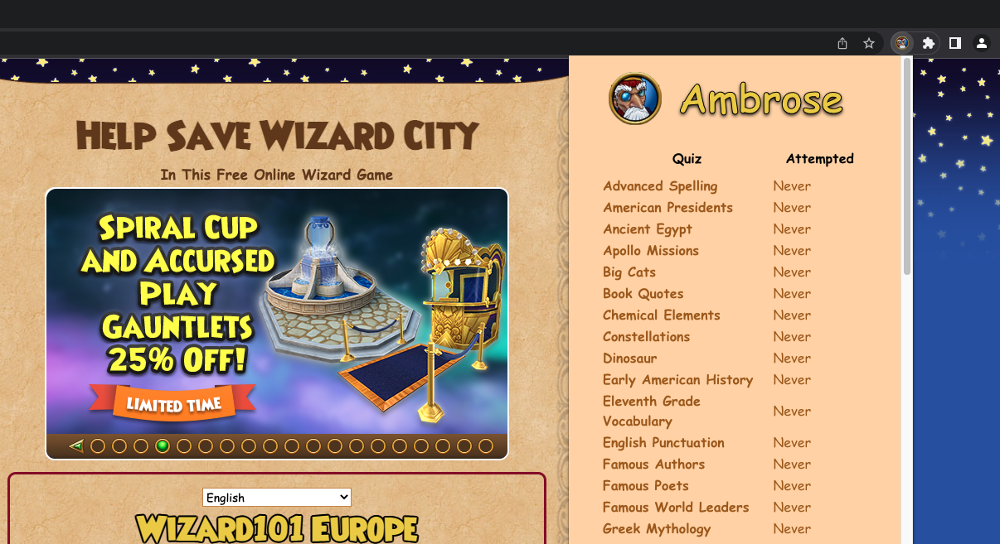
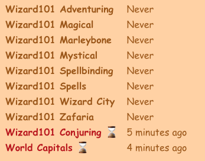

# Ambrose

  

 

## What This Is

This is a Chrome extension to easily answer [Wizard101 trivia quizzes](https://www.wizard101.com/game/trivia). You can answer up to 10 trivia quizzes per day to earn Crowns.

1. Removes artificial fade-in loading animation and highlights the correct answer.

    

2. Extension popup with links to all supported quizzes

    

3. Track when you last completed quizzes and when you can complete them again (22 hour cooldown)

    

## Is This Against TOS?

**TL;DR: I don't think so.**

According to the [Terms of Service](https://www.wizard101.com/game/termsofuse), one cannot use any robot, spider or other automatic device to access the site.

> You agree that you will not (a) use any robot, spider or other automatic device, process or means to access the Site, (b) use any manual process to monitor or copy any of the material on this site or for any other unauthorized purpose without the prior written consent of the Company, (c) use any device, software or routine that interferes with the proper working of the Site, (d) attempt to interfere with the proper working of the Site, (e) take any action that imposes an unreasonable or disproportionately large load on the Company’s infrastructure, or (f) access, reload or “refresh” transactional pages, or make any other request to transactional servers, more than once during any three (3) second interval.

This means that other trivia bots, such as those based on browser automation or programmatically sending HTTP requests are explicitly against the TOS.

By default, this extension will **only** do the following:

- Read the trivia question from the trivia site
- Highlight the suggested answer
- Remove the fade-in animation
- Track when you last completed a quiz and show if the cooldown is over

It will **not**:

- Automatically select or submit answers
- Bypass the mandatory CAPTCHAs

This extension serves as more of an answer suggester and does not perform any automated interactions with the site. To the best of my knowledge, this is fair game. There are many other legitimate extensions that constantly read the contents of webpages you visit and/or modify the webpage contents to serve their intended purpose - the idea is that once downloaded, the user is not obliged to render the HTML in any particular way.

### Optional Auto-Clicker

If you really want to fully automate the submission of answers, you can enable the **optional** auto-clicker. See PR [#3](https://github.com/zeyu2001/Ambrose/pull/3). **Note that doing this would be against the ToS.**

## How to Use

I currently do not have plans to publish this extension to the Chrome Web Store. While the previous extensions that received takedown requests from KI all performed automated interactions in breach of the TOS, I do not want to risk it.

Here's how you can install it manually.

1. Download `Ambrose-x.x.x.zip` from the [latest release](https://github.com/zeyu2001/Ambrose/releases)
2. Unzip this file.
3. In Chrome, go to [chrome://extensions](chrome://extensions)
4. Turn on "Developer mode"
5. Click "Load unpacked"
6. Browse to the extracted folder

## Security

As a security practitioner myself, I understand that there may be concerns about using an untrusted Chrome extension.

This extension does not store any information about you or your Wizard101 account. It does keep track of which quizzes you have completed, so that you don't do the same quiz twice in the same 22-hour period.

Importantly, the extension only ever has access to `https://www.wizard101.com/quiz/trivia/game/*` URLs and the Chrome extension storage API. This means that the extension does not run on any URLs other than the trivia-specific ones.

Like any other software, I would advise you to look for yourself and see if this is something you trust. Permissions are configured in the [`manifest.json`](./public/manifest.json) file.

## Contributing

Feel free to contribute to this project by adding/improving features or adding answers not currently found in [`answers.json`](./src/data/answers.json). I do not currently have the answers to all available quizzes.

If you face any issues using this extension, please open an issue in the Issues tab.
